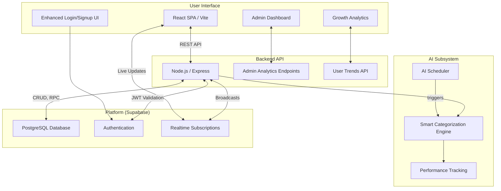

# Monity – AI-Powered Personal Finance Tracker

> **Mission:** *Make budgeting delightfully fast, powerfully intelligent, and totally transparent.*

[](https://opensource.org/licenses/MIT)


---

## Table of Contents

1.  [Why Monity?](#why-monity)
2.  [Feature Highlights](#feature-highlights)
3.  [Current Architecture](#current-architecture)
4.  [Project Layout](#project-layout)
5.  [Getting Started](#getting-started)
6.  [API Reference](#api-reference)
7.  [Data Model](#data-model)
8.  [Security](#security)
9.  [Testing](#testing)
10. [Configuration](#configuration)
11. [Deployment](#deployment)
12. [Recent Updates](#recent-updates)
13. [Roadmap](#roadmap)
14. [License](#license)
15. [About](#about)

---

## Why Monity?

*   **🧠 Truly Smart**: Goes beyond basic ledgers with a custom-trained AI model that learns your spending habits to automate tedious data entry.
*   **Modern Web Stack**: A robust Node.js + Express API powers a snappy, responsive React/Tailwind UI with beautiful animations and modern design.
*   **👥 Built for Collaboration**: The only finance tracker you'll find with real-time expense splitting for groups, perfect for trips with friends, roommates, and family.
*   **📊 Advanced Analytics**: Comprehensive admin dashboard with growth metrics, user analytics, and system health monitoring.
*   **🌐 Internationalized**: A bilingual interface (English & Portuguese) makes it accessible to a global audience.
*   **🎨 Beautiful & Functional UI**: A mobile-first dashboard with interactive charts, modern authentication forms, and a gorgeous dark mode.

---

## Feature Highlights

| Category | Highlights |
| :--- | :--- |
| **🤖 AI & Automation** | **Smart Categorization** using a Naive Bayes classifier & NLP • **Continuous learning** from user feedback • **Scheduled daily model retraining** with `node-cron` • **Real-time accuracy tracking**. |
| **👥 Collaboration** | Real-time **expense splitting** in groups • User search & invitations • Shared expense tracking and settlement. |
| **📈 Analytics & Admin** | **Enhanced admin dashboard** with growth metrics • User analytics (premium vs free) • Monthly trends • Category usage stats • System health monitoring • **AI performance tracking**. |
| **🔐 Security & Auth** | **Modern login/signup UI** with password strength indicators • Secure **JWT authentication** via Supabase • **Role-Based Access Control** (`user`, `premium`, `admin`) • Enhanced form validation. |
| **🌐 UX & Design** | **Enhanced authentication forms** with animations • **English & Portuguese** support • **Responsive, mobile-first** design • Real-time UI updates • **Modern gradient backgrounds** • Password visibility toggles. |

---

## Current Architecture

Monity is a modern, decoupled web application with a clear separation between the frontend, backend API, and a powerful BaaS (Backend as a Service) layer.



**Layer Break-down**

| Layer | Tech | Responsibilities |
| :--- | :--- | :--- |
| **Frontend** | React 19 + Vite + Tailwind CSS | **Enhanced UI components** • Modern auth forms • **Admin analytics dashboard** • Interactive charts & widgets • Client-side routing. |
| **API** | Node.js + Express.js | Business logic • **Advanced admin endpoints** • **Growth metrics API** • AI engine integration • User role management. |
| **AI Engine**| `natural`, `compromise`, `ml-naivebayes` | NLP processing • ML model training & prediction • **Performance analytics** • Feedback loop management. |
| **Platform** | Supabase | PostgreSQL data storage • JWT user authentication • Real-time websocket messaging • **Enhanced security**. |

---

## Project Layout

```
Monity/
├── backend/
│   ├── api.js                     # Express server with enhanced admin endpoints
│   ├── smart-categorization.js    # The AI/ML engine with performance tracking
│   ├── ai-scheduler.js            # node-cron background jobs
│   ├── expense-splitting.js       # Group expense logic
│   ├── package.json               # Backend NPM dependencies
│   └── __tests__/                 # Jest/Supertest API tests
├── frontend/
│   ├── src/
│   │   ├── components/            # Enhanced UI components
│   │   │   ├── AdminDashboard.jsx # Comprehensive admin analytics
│   │   │   ├── Login.jsx          # Modern authentication UI
│   │   │   └── Signup.jsx         # Enhanced signup with validation
│   │   ├── hooks/                 # Custom React hooks
│   │   ├── context/               # AuthContext for global state
│   │   ├── utils/                 # API client, i18n config
│   │   └── App.jsx                # Main router
│   └── package.json               # Frontend NPM dependencies
├── docs/                          # Screenshots, diagrams
├── migration_*.sql                # Supabase database migrations
└── README.md
```

---

## Getting Started

### Prerequisites

| Tool | Minimum Version | Notes |
| :--- | :--- | :--- |
| **Node.js** | 18 | Includes npm |
| **Supabase** | Cloud Account | Used for DB, Auth, and Realtime |

### Local Setup

1.  **Clone & Enter**
    ```bash
    git clone https://github.com/leo-stuart/Monity.git && cd Monity
    ```
2.  **Configure Supabase**
    *   Create a new project on [Supabase](https://supabase.com/).
    *   Navigate to the **SQL Editor**.
    *   Execute the content of `supabase_schema.sql`, followed by all `migration_*.sql` files to set up the database.
3.  **Install Backend Dependencies**
    ```bash
    cd backend && npm install
    ```
4.  **Install Frontend Dependencies**
    ```bash
    cd ../frontend && npm install
    ```
5.  **Set Environment Variables**
    *   In the `backend` directory, copy `.env.example` to `.env` (if available) or create it.
    *   In the `frontend` directory, create a `.env` file.
    *   Fill in the variables as described in the [Configuration](#configuration) section using the API keys from your Supabase project settings.

### Running the Stack

Open **two** separate terminals:

```bash
# Terminal 1 – REST API (Port 3001)
$ cd backend
$ npm start

# Terminal 2 – Vite Dev Server (Port 5173)
$ cd frontend
$ npm start
```

Visit **[http://localhost:5173](http://localhost:5173)** to use the application.

---

## API Reference

Authentication is handled via JWT Bearer tokens obtained from Supabase. The backend API provides over 50 endpoints including comprehensive admin analytics.

### Selected Endpoints

| Method | Path | Description |
| :--- | :--- | :--- |
| `POST` | `/ai/suggest-category` | Returns AI-powered category suggestions for a transaction description. |
| `POST` | `/ai/feedback` | Submits user feedback to the AI model for continuous learning. |
| `GET` | `/ai/stats` | **NEW**: Returns AI categorization performance metrics (admin only). |
| `GET` | `/admin/analytics` | **NEW**: Comprehensive growth and user analytics (admin only). |
| `GET` | `/admin/trends` | **NEW**: Daily activity trends and user engagement metrics (admin only). |
| `POST` | `/groups` | Creates a new expense-splitting group. |
| `GET` | `/groups/:id`| Fetches details, members, and expenses for a specific group. |
| `POST` | `/shares/:id/settle` | Settles a debt within a group, creating the corresponding transactions. |

### New Admin Analytics Endpoints

The enhanced admin dashboard now provides comprehensive insights:

* **User Growth**: Total users, premium vs free breakdown, recent signups
* **Financial Metrics**: Transaction volumes by type, total platform volume
* **Engagement**: Daily active users, transaction trends, category usage
* **AI Performance**: Categorization accuracy, model metrics, feedback analysis
* **System Health**: Database status, API performance, real-time monitoring

---

## Data Model

The data is stored in a relational PostgreSQL database managed by Supabase. Key tables include:

*   `profiles`: Stores user data with subscription tiers, extending `auth.users`.
*   `transactions`, `categories`, `budgets`: Core financial tracking tables.
*   `groups`, `group_members`, `group_expenses`: Powers the expense-splitting feature.
*   `categorization_feedback`, `ml_training_data`, `ml_model_metrics`: Store data for the AI feedback loop and model retraining with performance tracking.

---

## Security

*   **Enhanced Authentication**: Modern login/signup UI with password strength indicators and real-time validation.
*   **Authorization**: Role-Based Access Control (RBAC) with enhanced admin endpoints for platform analytics.
*   **Password Security**: Strong password enforcement with visual strength indicators and comprehensive validation.
*   **Data Protection**: User passwords are handled and hashed securely by Supabase Auth.

---

## Testing

The project includes a comprehensive test suite for both frontend and backend.

```bash
# Run backend tests
$ cd backend && npm test

# Run frontend tests
$ cd frontend && npm test
```

---

## Configuration

Create `.env` files in both the `backend` and `frontend` directories.

**`backend/.env`**
```env
# The URL of your Supabase project
SUPABASE_URL=https://<your-project-ref>.supabase.co

# The service_role key (secret) for admin-level API access
SUPABASE_KEY=<your-supabase-service-role-key>

# The anon key (public) for user-level API access
SUPABASE_ANON_KEY=<your-supabase-anon-key>

# The port for the backend server
PORT=3001
```

**`frontend/.env`**
```env
# The URL of your Supabase project
VITE_SUPABASE_URL=https://<your-project-ref>.supabase.co

# The anon key (public) for the Supabase client
VITE_SUPABASE_ANON_KEY=<your-supabase-anon-key>

# The URL of your running backend API
VITE_API_URL=http://localhost:3001
```

---

## Deployment

The frontend and backend are deployed as separate services.

*   **Backend**: Can be deployed to any Node.js hosting provider like Render or Heroku. Remember to set the environment variables in your hosting provider's dashboard.
*   **Frontend**: As a static site, the `frontend/dist` folder (created by `npm run build`) can be deployed to services like Vercel or Netlify.

---

## Recent Updates

### 🎨 Enhanced UI/UX (Latest)
- **Modern Authentication**: Completely redesigned login and signup forms with:
  - Animated gradient backgrounds
  - Password strength indicators
  - Real-time form validation
  - Show/hide password functionality
  - Smooth animations and micro-interactions
- **Responsive Design**: Mobile-optimized authentication flows
- **Enhanced Security**: Strong password enforcement with visual feedback

### 📊 Advanced Admin Dashboard
- **Comprehensive Analytics**: Growth metrics, user breakdowns, financial insights
- **Real-time Monitoring**: System health indicators, API performance tracking
- **User Engagement**: Active user metrics, transaction trends, category analytics
- **AI Performance**: Categorization accuracy tracking, model performance metrics
- **Visual Improvements**: Modern card designs, interactive elements, professional styling

### 🚀 Backend Enhancements
- **New Admin Endpoints**: `/admin/analytics` and `/admin/trends` for comprehensive platform insights
- **Enhanced Data Processing**: Monthly growth tracking, user activity analysis
- **Performance Monitoring**: AI model accuracy tracking and performance metrics
- **Improved Security**: Enhanced admin-only endpoints with proper authorization

---

## Roadmap

| Quarter | Milestone |
| :--- | :--- |
| **Q1-2025** | **Enhanced Charts**: Interactive data visualizations for admin dashboard and user analytics. |
| **Q2-2025** | **Mobile App**: React Native mobile application with offline sync capabilities. |
| **Q3-2025** | **Plaid Integration**: Connect directly to bank accounts to import transactions automatically. |
| **Q4-2025** | **Advanced AI Insights**: Implement financial forecasting and anomaly detection features. |
| **Q1-2026** | **Dockerization**: Provide a `docker-compose.yml` for easy, one-command local setup. |

---

## License

Distributed under the **MIT License**. See the [LICENSE](LICENSE) file for details.

---

## About

Monity is an educational side-project by [Leo Stuart](https://github.com/leo-stuart). Contributions and PRs are welcome!

*Built with ❤️ using modern web technologies and a focus on user experience.*
