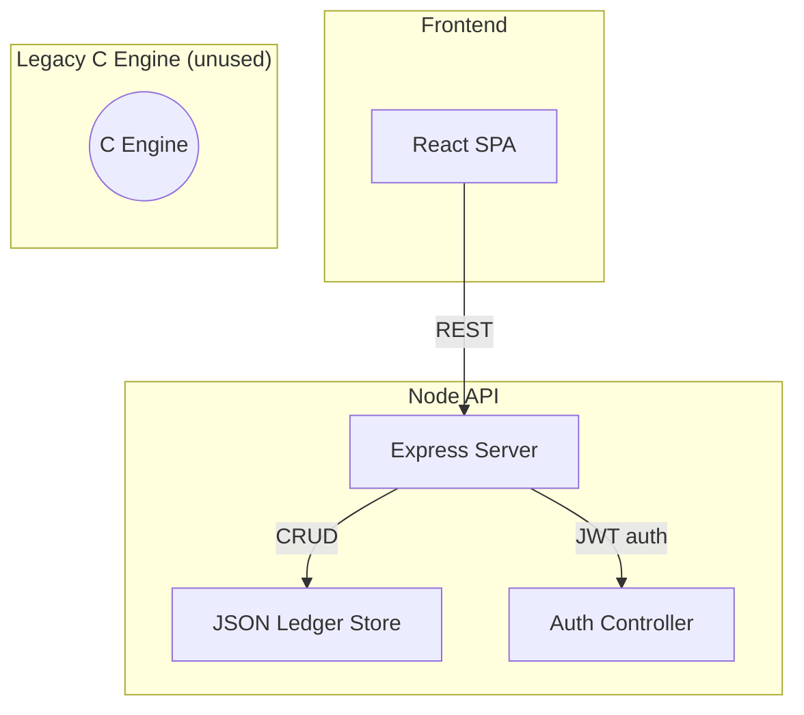

# Monity – Personal Finance Tracker

> **Mission:** *Make budgeting delightfully fast, totally transparent, and hacker‑friendly.*


## ⚠️ Legacy C Engine

Monity began life as a lightning‑fast **C 17** command‑line program. While the source still ships in `backend/src/` (and you’re welcome to tinker with it), **the production stack no longer calls the C binary**. All runtime logic now lives inside the **Node.js API** and **React** dashboard. The C code remains for historical interest and as a learning reference only.

---

## Table of Contents

1. [Why Monity?](#why-monity)
2. [Feature Highlights](#feature-highlights)
3. [Current Architecture](#current-architecture)
4. [Project Layout](#project-layout)
5. [Getting Started](#getting-started)
6. [API Reference](#api-reference)
7. [Data Model](#data-model)
8. [Security](#security)
9. [Testing](#testing)
10. [Configuration](#configuration)
11. [Deployment](#deployment)
12. [Roadmap](#roadmap)
13. [Contributing](#contributing)
14. [License](#license)
15. [About](#about)

---

## Why Monity?

* **Local‑first**: Keep your money data on your machine — *no third‑party cloud required.*
* **Modern Web stack**: Node + Express API with a snappy React/Tailwind UI.
* **Script‑ready**: REST endpoints accept JSON – perfect for cURL, Zapier, or cron jobs.
* **Beautiful UI**: A mobile‑first dashboard with charts, filters, and dark‑mode.

*(Need the original terminal workflow? Build the C binary, it still works!)*

---

## Feature Highlights

| Category  | Highlights                                                                                        |
| --------- | ------------------------------------------------------------------------------------------------- |
| Tracking  | Add / edit / delete **expenses** & **incomes** • category & date tags                             |
| Analytics | Monthly balance • Category pie chart • Income vs Expense trend • “Most expensive purchase” widget |
| UX        | JWT login & sign‑up • Mobile‑first layout • Real‑time dashboard updates • Skeleton loaders        |
| Data      | One‑click JSON **export/import**                                                                  |

---

## Current Architecture



**Layer Break‑down**

| Layer        | Tech                                      | Responsibilities                              |
| ------------ | ----------------------------------------- | --------------------------------------------- |
| **API**      | Node.js 20 + Express 5                    | Business logic • JWT auth • CRUD ledger files |
| **Storage**  | Plain‑text ledgers (CSV)                  | Human‑diffable expenses & incomes             |
| **Frontend** | React 19 + Vite + Tailwind CSS + Chart.js | Responsive dashboards • charts & widgets      |

---

## Project Layout

```
Monity/
├── backend/
│   ├── src/               # 💾 LEGACY C code (unused by API)
│   ├── ledgers/           # expenses.txt & incomes.txt
│   ├── api.js             # Express server
│   ├── db.json            # JSON Server mock database
│   ├── package.json       # backend NPM deps
│   └── Makefile           # builds the legacy C binary
├── frontend/
│   ├── src/               # React components, pages, hooks
│   ├── public/
│   ├── tailwind.config.js
│   └── vite.config.js
├── docs/                  # OpenAPI spec, screenshots, diagrams
├── .env.example
└── README.md
```

---

## Getting Started

### Prerequisites

| Tool        | Minimum Version | Notes                       |
| ----------- | --------------- | --------------------------- |
| Node.js     | 20              | includes npm 10             |
| JSON Server | latest          | `npm i -g json-server`      |
| Vite        | bundled         | installed via frontend deps |

### Local Setup

```bash
# 1. Clone & enter
$ git clone https://github.com/leo-stuart/Monity.git && cd Monity

# 2. Install backend deps
$ cd backend && npm install

# 3. Install frontend deps
$ cd ../frontend && npm install
```

*Optional:* build legacy C binary:

```bash
$ cd backend && make build
```

### Running the Stack

Open **two** terminals (plus one optional for JSON Server):

```bash
# Terminal 1 – REST API (port 3000)
$ cd backend && node api.js

# Terminal 2 – Vite dev server (port 5173)
$ cd frontend && npm run dev

# [Optional] Terminal 3 – JSON Server mock DB (port 3001)
$ cd backend && json-server --watch db.json --port 3001
```

Visit **[http://localhost:5173](http://localhost:5173)** and log in with `demo@monity.dev / demopass`.

> **TIP:** Copy `.env.example` to `.env` to customise ports, JWT secret, or ledger file paths.

---

## API Reference

Authentication:

```http
POST /login
Content‑Type: application/json

{ "email": "demo@monity.dev", "password": "demopass" }
```

Return:

```json
{ "token": "<jwt>" }
```

### Selected Endpoints

| Method                                        | Path        | Body                                      | Description           |
| --------------------------------------------- | ----------- | ----------------------------------------- | --------------------- |
| `POST`                                        | `/expenses` | `{ description, amount, category, date }` | Adds an expense       |
| `GET`                                         | `/expenses` | –                                         | List expenses         |
| `POST`                                        | `/incomes`  | `{ description, amount, category, date }` | Adds an income        |
| `GET`                                         | `/balance`  | –                                         | Returns total balance |
| Full OpenAPI spec lives at **docs/api.yaml**. |             |                                           |                       |

---

## Data Model

Ledger files are newline‑separated CSV with four columns:

```
<description>,<amount>,<category>,<dd/mm/yyyy>
```

No quotes, no header row.

---

## Security

* **BCrypt** hashed passwords (salt rounds = 10).
* **JWT** tokens signed with `JWT_SECRET` (HS256).
* Helmet‑style CORS policy (origin whitelist in `.env`).
* Express‑validator for input sanitisation.

---

## Configuration

Create `.env` in repo root or `backend`:

```
# Backend
PORT=3000
JWT_SECRET=supersecret
LEDGER_PATH=./backend/ledgers

# Frontend
VITE_API_URL=http://localhost:3000
```

---

## Deployment

### Docker Compose (coming soon)

`docker-compose.yml` will orchestrate API and React build.

---

## Roadmap

| Quarter     | Milestone                                                 |
| ----------- | --------------------------------------------------------- |
| **Q3‑2025** | Migrate ledgers to SQLite or PostgreSQL                   |
| **Q4‑2025** | Docker Compose & Kubernetes Helm chart                    |
| **Q1‑2026** | Mobile PWA & native macOS menu bar app                    |
| **Q2‑2026** | Plugin ecosystem (currency conversion, bank integrations) |

---

## Contributing

1. **Fork & clone** → `git switch -c feat/my-feature`.
2. Ensure prettier/eslint pass and **tests are green**.
3. Open a **pull request** using the template.

Code of Conduct: see `docs/CODE_OF_CONDUCT.md`.

---

## License

Distributed under the **MIT License**.

---

## About

Monity is an educational side‑project by [Leo Stuart](https://github.com/leo-stuart). PRs welcome!
